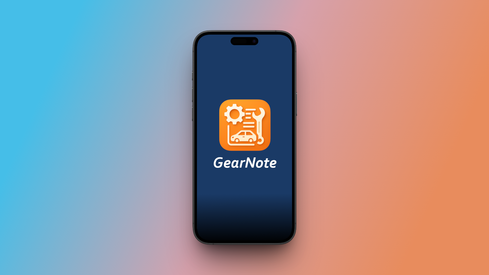

# GearNote - App de Mantenimiento de Vehículos

**GearNote** es una aplicación móvil desarrollada con **Expo (React Native)** que te permite llevar un registro completo del mantenimiento de tus vehículos.

Podrás guardar datos como el modelo, marca, matrícula, kilómetros, motor, ficha técnica, notas adicionales y hasta una imagen personalizada.

🛠️ **Todos los datos se almacenan localmente en tu dispositivo**, sin necesidad de conexión a internet ni sincronización externa.

---

## 📲 Descargar la app lista para usar

Si solo deseas usar la aplicación sin modificar el código:

1. Dirígete a la sección de [**releases del repositorio**](https://github.com/SCrbnll/GearNote/tree/main/releases).
2. Descarga la **última versión disponible** (archivo `.apk` para Android).
3. Instálala manualmente en tu dispositivo móvil.
4. ¡Listo! Ya puedes comenzar a registrar y gestionar tus vehículos.

---

## 🔐 Privacidad

✅ **100% local**  
> Tus datos no salen del dispositivo. No se suben a la nube ni se comparten con terceros.

---

## ⚙️ Requisitos previos (para desarrollo)

Si prefieres ver o modificar el código fuente, estos son los requisitos para ejecutar el proyecto localmente:

- [Node.js](https://nodejs.org/) (recomendado v18 o superior)
- Emulador Android/iOS configurado o bien la app Expo Go instalada en tu dispositivo móvil: Google Play / App Store
- **Expo CLI**, que puedes instalar globalmente con:

```bash
npm install -g expo-cli
```

## 🧪 Instalación y ejecución

1. Clona este repositorio en tu máquina local.

2. Abre una terminal y navega hasta la carpeta del proyecto.

3. Ejecuta el siguiente comando:

```bash
npx expo start
```
> Escanea el QR que aparece en la terminal con la app Expo Go o ejecuta en un emulador.


